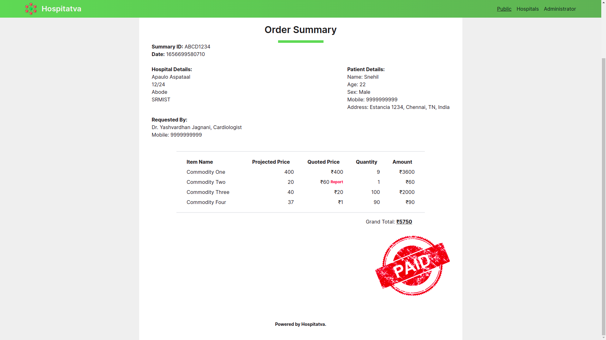
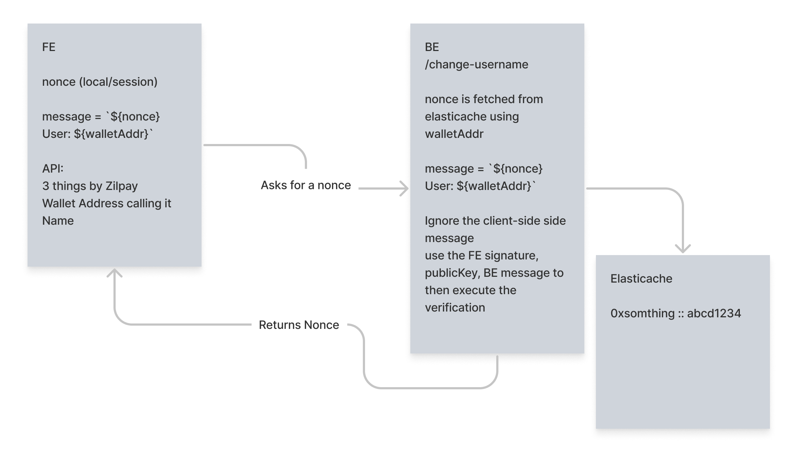

  

  

 

<b>
Team HaanDoobey presents Hospitatva.
</b>

<blockquote align="center"> 
  built on ☕ at <a href="https://www.sih.gov.in/">SIH 2022</a>.

</blockquote>
 

---

 

# 💡 Problem Statement

During Covid – 19 crisis, many private hospitals had charged huge and unimaginable amounts from patients and made enormous profits taking advantage of panic conditions. Notwithstanding of spending huge amounts many families lost their members and in some instances hospitals even demanded clearance of pending bills for handing over bodies to their families. There was no proper information about availability of beds and details of treatment provided etc. In order to curb this exploitation by private hospitals, there is a requirement of national information portal which can regulate all the private hospitals and provide accurate details of rates and medical facilities available in the private hospitals across the country to guide the citizens to get affordable medical emergency services as per their choice and availability.

 

# 🧠 Knowledge Primer

A distributed ledger-based blockchain implementation of the rates proposed and charged, and the commodity count by hospitals for treatment and consultancy of patients. We aim to make the fair prices of medical commodities publicly available aggregating real-time data from multiple sources. We also aim to make the medical inventory available in the hospital public. This will prevent, if not eradicate the exploitation done by private hospitals charging its patients for the services offered.

- There are three portals namely the **Patient** _(Public)_, **Management** _(Hospitals)_, **Government** _(Supervisors)_ portals.
  - The _Patients'_ portal can be used to get a list of the hospitals, and their details, including their inventory with the availability, and the price. They can then as per their need book a session and get the digital invoice here itself. The invoice has comparison for the government recommended price and enables flagging options incase of an anomaly.
  - The _Managements'_ portal is where every hospitals' staff and management can perform an inventory check.
  - The _Governments'_ portal is where the officials receive the flagged queries and can supervise whether it is legitimate or a spam.

 

# 📺 Preview

  

  

  

  

  

  

  

 

# 💻 Tech Stack

- AWS
- NextJS
- NodeJS
- scikit-learn
- Scilla
- Serverless Stack
- Smart Contracts
- StreamLit
- TensorFlow
- TypeScript
- Zilliqa

 

# 📦 Inside the box

- **Frontend Server:**
  - _Public -_ A national information portal that displays hospital information as well as the commodity data of the hospital.
  - _Hospital -_ `DID` nonce-based authentication using `MagicLink` and `CRUD` commodities for the hospital
  - _Government -_ `DID` nonce-based authentication using `MagicLink` and resolution of tickets generated
- **Backend Lambdas:**
  - Generating nonce-based authentication
  - `GET` Endpoint for information of hospitals and their commodities
  - `CRUD` commodities and save it in respective hospital contract
  - Modify `DynamoDB` tables that track commodity price
  - Calling a ML endpoint for price prediction for a sliding window of 30 price entries and save the prediction in the global smart contract
  - Generate a bill/summary with reporting options as per the ML predictions
- **ML Server:**
  - Predicts the price in a batch of 30 inputs.

 

# ⏭️ What's next

- Training the model on actual data, currently, we are using falsified data due to a lack of original data.
- Making the UI more intuitive and user-friendly.
- Creating an ML executable instead of an API
- Region-based implementation

 

# 📜 License

`Hospitatva` is available under the MIT license. See the [`LICENSE`](https://github.com/jagnani73/hospitatva/blob/main/LICENSE) file for more info.

 

# 🤝 Contributing

Please read [`Contributing.md`](https://github.com/jagnani73/hospitatva/blob/main/Contributing.md) for details on our code of conduct, and the process for submitting pull requests to us.

 

# 💥 Contributors

              
 
                                                                    
# 🚨 Forking this repo

Many people have contacted us asking if they can use this code for their own websites. The answer to that question is usually "yes", with attribution. There are some cases, such as using this code for a business or something that is greater than a personal project, that we may be less comfortable saying yes to. If in doubt, please don't hesitate to ask us.

We value keeping this site open source, but as you all know, _**plagiarism is bad**_. We spent a non-negligible amount of effort developing, designing, and trying to perfect this iteration of our website, and we are proud of it! All we ask is to not claim this effort as your own.

Refer to this handy [quora post](https://www.quora.com/Is-it-bad-to-copy-other-peoples-code) if you're not sure what to do. Thanks!
